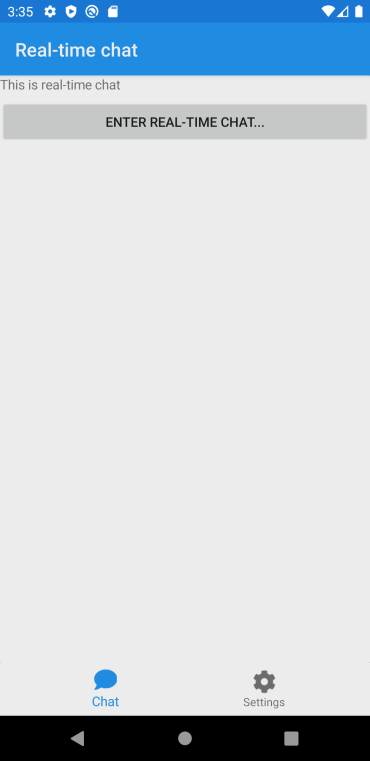
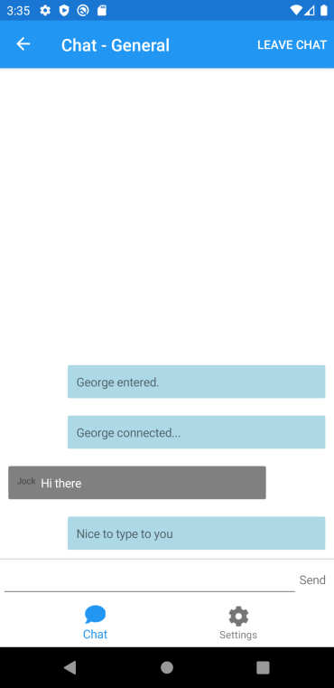
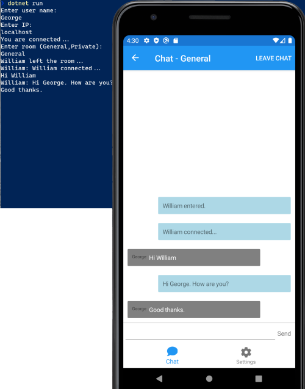

# XamarinSignalRChat
A SignalR and Xamarin.Forms chat application.  Including local debugging and running, console and Xamarin.Forms mobile apps.  The Xamarin.Forms app showcases the use of material Design, CollectionView, Dependency Injection, MVVM, extended controls, template selectors, use of custom fonts, all within the new Shell container.

## What is SignalR?
ASP.NET Core SignalR is an open-source library that simplifies adding real-time web functionality to apps. Real-time web functionality enables server-side code to push content to clients instantly.

## What is Xamarin.Forms?
Xamarin.Forms is an open-source UI framework. Xamarin.Forms allows developers to build Xamarin.Android, Xamarin.iOS, and Windows applications from a single shared codebase.

Xamarin.Forms allows developers to create user interfaces in XAML with code-behind in C#. These interfaces are rendered as performant native controls on each platform.

## ScreenShots




## Local running & debugging

### Run the back-end localy
Before debugging the mobile application, it is necessary to have the back-end running.  To run the back-end:
- Lauch CMD or PowerShell.
- Navigate to the project folder for the Back-end.

```cd .\XamarinSignalRChat\src\BackEnd\XamarinSignalRChat.ChatService\```

- Run the back-end (You may need to build first):

```dotnet run```

- Use CTRL+C to cancel running the back-end.

### Using the console app to test the back-end
By using the console app, you can test the back-end both locally and on any published endpoint.  It is important to note that the back-end must be running before trying to connect.  Also, you can run more than one console instance at the same time!
- Launch CMD or PowerShell.
- Navigate to the project folder for the console app.

```cd .\XamarinSignalRChat\src\Console\XamarinSignalRChat.Console\```

- Run the console app (You may need to build first):

```dotnet run```

- Enter your user name when prompted.
- Enter the IP for the back-end service when prompted.
  - If using a running local instance (see above), enter ```localhost```
  - If using an Azure hosted instance, enter the name of the published Azure app E.g. ```XamarinSignalRChatService.azurewebsites.net```
- When prompted, enter the name of a chat room to join.  NOTE: The mobile app is coded to use "General".
- Enter your chat text as needed.
- If you wish to leave the chat group, enter the command ```leave```
- If you wish to exit the chat, enter the command ```exit```

## Azure pipelines
Included in this repository are Azure Pipelines that are triggered on changes to the appropriate area of the code and will restore, build, test, publish, generate artefacts and deploy to Azure.  See [What is Azure Pipelines?](https://docs.microsoft.com/en-us/azure/devops/pipelines/get-started/what-is-azure-pipelines) for details.
### Chat Service Back-End pipeline
See [azure-pipelines-ChatService.yml](azure-pipelines-ChatService.yml)

In the pipeline, the task 'AzureRmWebAppDeployment@4' needs to be configured with your Azure subscription and application name.  See [Connect to Microsoft Azure](https://docs.microsoft.com/en-us/azure/devops/pipelines/library/connect-to-azure) for details.
### Android piepline
See [azure-pipelines-android.yml](azure-pipelines-android.yml). This pipeline "at time of writing" only builds, signs, archies and publishes the artefact!

In preparing the application for release, android requires that the app is signed for publishing. See [Signing the Android Application Package](https://docs.microsoft.com/en-us/xamarin/android/deploy-test/signing/) for details.

In the pipeline, the task 'AndroidSigning@3' requires that you upload the keystore file to the secure files. See [Secure files](https://docs.microsoft.com/en-us/azure/devops/pipelines/library/secure-files) for details.

It also requires that a number of variables be configured for the pipeline.  These should be secret variables.  See [Set secret variables](https://docs.microsoft.com/en-us/azure/devops/pipelines/process/variables#secret-variables) for details.
- keystore-filename: 'the name of the keysore file uploaded to the secure files'
- keystore-password: The keystore password
- keystore-alias: They keystore alias name
- key-password: The key password (often the same as the keystore password)

### iOS pipeline
!!!TODO!!!

## Publishing the back-end to Azure web sites
Before you publish the back-end to Azure web sites, you need to change the src\Mobile\XamarinSignalRChat\Helpers\UserSettingsManager.cs and set the correct URL for the hosted app.

```
#if DEBUG
	private static readonly string DefaultChatIP = DeviceInfo.Platform == DevicePlatform.Android ? "10.0.2.2" : "localhost"; // NOTE: 10.0.2.2 is the Android equivalent of localhost
#else
	private static readonly string DefaultChatIP = "NAMEOFYOURPUBLISHEDAPPHERE.azurewebsites.net;
#endif
```

## References
This is all inspired from [James Montemagno's XamChat](https://github.com/jamesmontemagno/XamChat).
- [Introduction to ASP.NET Core SignalR](https://docs.microsoft.com/en-us/aspnet/core/signalr/introduction)
- [What is Xamarin.Forms?](https://docs.microsoft.com/en-us/xamarin/get-started/what-is-xamarin-forms)
- [Xamarin.Essentials](https://docs.microsoft.com/en-us/xamarin/essentials/)
- [Quick Tip: Debugging Local ASP.NET Core Web APIs on Android Emulators](https://devblogs.microsoft.com/xamarin/debug-local-asp-net-core-web-apis-android-emulators/)
- [FlyMe Sample App](https://github.com/davidortinau/FlyMe)
- [What is Azure Pipelines?](https://docs.microsoft.com/en-us/azure/devops/pipelines/get-started/what-is-azure-pipelines)
  - [Connect to Microsoft Azure](https://docs.microsoft.com/en-us/azure/devops/pipelines/library/connect-to-azure)
  - [Signing the Android Application Package](https://docs.microsoft.com/en-us/xamarin/android/deploy-test/signing/)
  - [Secure files](https://docs.microsoft.com/en-us/azure/devops/pipelines/library/secure-files)
  - [Set secret variables](https://docs.microsoft.com/en-us/azure/devops/pipelines/process/variables#secret-variables)